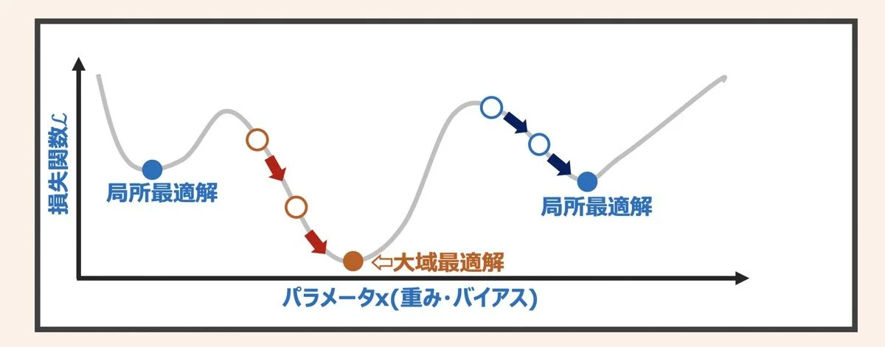

# Fortranによる物理シミュレーションモデルのパラメータチューニング方法について

## 目次
1. [はじめに](#1-はじめに)
2. [パラメータチューニングとは](#2-パラメータチューニングとは)
3. [主要な最適化手法の比較](#3-主要な最適化手法の比較)
4. [複数地点データの統合](#4-複数地点データの統合)
5. [実践的な推奨フロー](#5-実践的な推奨フロー)
6. [Appendix](#Appendix)

---

## 1. はじめに

### 本資料の目的
物理シミュレーションモデルのパラメータを実測値にフィッティングする際の最適化手法を解説します。

＊実測値にフィッティングさせることを仮の目的に置いております

### 想定する問題
```
実測データ: y_obs(t₁), y_obs(t₂), ..., y_obs(tₙ)
物理モデル: y_model(t; p₁, p₂, ..., pₘ)
目的: 実測とモデルの差を最小化するパラメータp₁, p₂, ...を求める
```

### 目的関数
残差二乗和（RSS: Residual Sum of Squares）を最小化：
```
RSS = Σ[y_obs(tᵢ) - y_model(tᵢ; p)]²
```

---

## 2. パラメータチューニングとは

### 2.1 基本概念

パラメータチューニングは、モデルの予測値と実測値（観測データなど）の差を最小化するパラメータを探索するプロセスです。

```
┌─────────────┐
│ 観測データ   │
└──────┬──────┘
       │
       ▼
┌─────────────────────┐
│ パラメータ候補       │
│ p = [p₁, p₂, ...]   │
└──────┬──────────────┘
       │
       ▼
┌─────────────────────┐
│ 物理モデル実行       │
│ y_model = f(t, p)   │
└──────┬──────────────┘
       │
       ▼
┌─────────────────────┐
│ 残差計算             │
│ RSS = Σ(obs-model)² │
└──────┬──────────────┘
       │
       ▼
┌─────────────────────┐
│ 最適化アルゴリズム   │
│ 次のパラメータ決定   │
└──────┬──────────────┘
       │
       └─→ 収束するまで繰り返し
```

### 2.2 最適化の種類

#### 局所最適化 vs 大域最適化





- **局所最適化**：開始点から近傍を探索（高速だが局所解に陥る可能性）
- **大域最適化**：パラメータ空間全体を探索（確実だが時間がかかる）

---

## 3. 主要な最適化手法の比較

以下の最適化ライブラリを紹介します。

1. [MINPACK](MINPACK.md)
2. [NLopt](NLopt.md)
3. [Optuna](Optuna.md) 

### 3.1 概要比較表

| 手法 | 言語 | 制約条件 | 探索方法 | 適用場面 |
|------|------|---------|---------|---------|
| **MINPACK** | Fortran | 不可 | 勾配ベース（局所） | データフィッティング |
| **NLopt** | C (Fortranバインディング) | 可能 | 多様 | 制約付き最適化 |
| **Optuna** | Python (Fortran呼び出し) | 可能 | ベイズ最適化（大域） | 高度な探索 |

### 3.2 詳細比較表

| 特徴 | MINPACK | NLopt | Optuna |
| - | - | - | - |
| **言語** | Fortran 77 | C (Fortranバインディング有) | Python |
| **境界制約** | ❌ なし | ✅ 直接サポート | ✅ 直接サポート |
| **一般制約** | ❌ なし | ✅ 可能 | △ ペナルティ法で対応 |
| **勾配不要** | ✅ LMDIF | ✅ 多数 | ✅ 全て |
| **アルゴリズム数** | 主に1つ(LM法) | 30以上 | 10以上 |
| **インストール** | 簡単 | やや面倒 | 簡単 |
| **コーディング言語** | Fortranで完結 | Fortranで完結 | Python必須 |
| **学習コスト** | 低 | 中 | 中〜高 |
| **大域探索** | ❌ | 限定的 | ✅ 優秀 |
| **可視化機能** | ❌ | ❌ | ✅ 充実 |


### 3.3 計算パターンの違い

#### MINPACK
```
反復回数: 20〜100回程度
探索方法: 勾配情報を使って効率的に最適解へ

初期値 → 改善 → 改善 → ... → 収束
  p₀      p₁      p₂           p*

特徴: 高速だが初期値依存性が高い
```

#### NLopt
```
反復回数: 50〜500回程度
探索方法: 境界制約を満たしながら最適化

パラメータ範囲: [下限, 上限]
  p_min ≤ p ≤ p_max
を保証しながら探索

特徴: 物理的制約を自然に扱える
```

#### Optuna
```
試行回数: 100〜1000回程度
探索方法: 境界制約を満たしつつ過去の試行結果を学習しながら探索

試行1: ランダム探索
試行2: 学習開始
試行3: 有望な領域を重点的に
...
試行N: 最適解に収束

特徴: 大域解を見つけやすいが時間がかかる
```

### 3.4 選択基準

| 状況 | 推奨手法 | 理由 |
|------|---------|------|
| 良い初期値がある | MINPACK | 高速、効率的 |
| 初期値が不明 | Optuna | 大域探索が得意 |
| 制約条件が必要 | NLopt/Optuna | 制約を直接扱える |
| Fortran完結希望 | MINPACK/NLopt | Python不要 |
| 確実に大域解が欲しい | Optuna+マルチスタート | 最も確実 |

---

## 4. 複数地点データの統合

複数の実測値にフィッティングさせることも可能です。

### 4.1 問題設定

複数の観測地点でデータがある場合、全地点のデータを統合して最適化を行うことができます。

```
地点A: n_A個の観測データ → RSS_A
地点B: n_B個の観測データ → RSS_B
地点C: n_C個の観測データ → RSS_C

目的: RSS_total = RSS_A + RSS_B + RSS_C を最小化
```

### 4.2 実装方法

- [方法1：単純合計](Multi-point-fitting.md)
- [方法2：重み付き合計](Multi-point-fitting.md)
- [方法3：正規化RSS](Multi-point-fitting.md)
- [方法4：地点別パラメータと共通パラメータ](Multi-point-fitting.md)

### 4.3 選択基準

| 状況 | 推奨方法 | 理由 |
|------|---------|------|
| データ数が同程度 | 単純合計 | シンプルで解釈しやすい |
| データ数が大きく異なる | 重み付き合計 | 公平な評価が可能 |
| スケールが異なる | 正規化RSS | 異なる桁のデータを比較可能 |
| 地点差が大きい | 地点別パラメータ | 各地点の特性を考慮 |
| 物理法則が共通 | 共通パラメータ | 汎用性が高いモデル |

---

## 5. 実践的な推奨フロー

### 5.1 状況別の選択フローチャート

```
開始
  ↓
┌──────────────────┐
│ 境界制約が必要？  │
└────┬─────────────┘
     │
     ├─ YES → ┌──────────────────┐
     │        │ Fortran完結希望？ │
     │        └────┬─────────────┘
     │             │
     │             ├─ YES → NLopt
     │             │
     │             └─ NO → Optuna
     │
     └─ NO → ┌──────────────────┐
             │ 良い初期値がある？│
             └────┬─────────────┘
                  │
                  ├─ YES → MINPACK
                  │
                  └─ NO → ┌──────────────────┐
                          │ 計算時間に余裕？  │
                          └────┬─────────────┘
                               │
                               ├─ YES → Optuna
                               │
                               └─ NO → MINPACK
                                       (マルチスタート)
```

### 5.2 段階的アプローチ（案）

#### フェーズ1：MINPACKで動作確認

```
目的: 最適化が正しく動作するか確認

手法: MINPACK
理由: 最もシンプルで実装が容易

チェック項目:
□ 観測データが正しく読み込めるか
□ 物理モデルが正常に実行されるか
□ 最適化が収束するか
□ 結果が物理的に妥当か
```

#### フェーズ2：NLoptで制約の追加

```
目的: パラメータの物理的制約を考慮

手法: NLopt (BOBYQA)
理由: 境界制約を自然に扱える

実装:
1. MINPACKのコードをベースに
2. 境界制約を追加
3. 結果を比較
```

#### フェーズ3：Optunaで大域探索

```
目的: より確実に最適解を見つける

手法: Optuna + マルチスタート
理由: 局所解に捕まるリスクを低減

実装:
1. NLoptの結果をベースライン
2. Optunaで大域探索
3. 両者の結果を比較
```

### 5.3 実装チェックリスト

#### 準備段階
- [ ] 観測データの整理（欠損値の処理、フォーマット統一）
- [ ] 初期値の調査
- [ ] パラメータの物理的妥当範囲の調査
- [ ] 計算環境の確認（ライブラリのインストール）

#### 実装段階
- [ ] 物理モデルの動作確認
- [ ] 観測データ読み込みの確認
- [ ] 残差計算の検証
- [ ] 最適化の収束テスト

#### 評価段階
- [ ] 最適化の収束性確認
- [ ] 複数の初期値での試行
- [ ] 結果の物理的妥当性検証
- [ ] 観測データとモデルの比較プロット

---

## Appendix

## 付録A:参考文献とリソース

### A.1 ライブラリのドキュメント

**MINPACK**
- 公式サイト: http://www.netlib.org/minpack/
- ユーザーガイド: http://www.netlib.org/minpack/disclaimer

**NLopt**
- 公式サイト: https://nlopt.readthedocs.io/
- アルゴリズム一覧: https://nlopt.readthedocs.io/en/latest/NLopt_Algorithms/

**Optuna**
- 公式サイト: https://optuna.org/
- チュートリアル: https://optuna.readthedocs.io/en/stable/tutorial/index.html

---

## 付録B:用語集

| 用語 | 説明 |
|------|------|
| **RSS** | Residual Sum of Squares（残差二乗和）、モデルと観測の差の二乗和 |
| **目的関数** | 最小化（または最大化）する関数 |
| **パラメータ空間** | 最適化するパラメータが取りうる値の範囲 |
| **局所解** | 近傍では最適だが大域的には最適でない解 |
| **大域解** | パラメータ空間全体で最適な解 |
| **勾配** | 目的関数の傾き、パラメータに関する微分 |
| **ヤコビ行列** | 多変数関数の偏微分を並べた行列 |
| **境界制約** | パラメータの上限・下限の制約 |
| **収束** | 最適化が解に到達すること |
| **ベイズ最適化** | 過去の試行結果から学習して効率的に探索する手法 |
| **マルチスタート** | 異なる初期値や条件で複数回最適化を実行する手法 |

---

**資料の終わり**